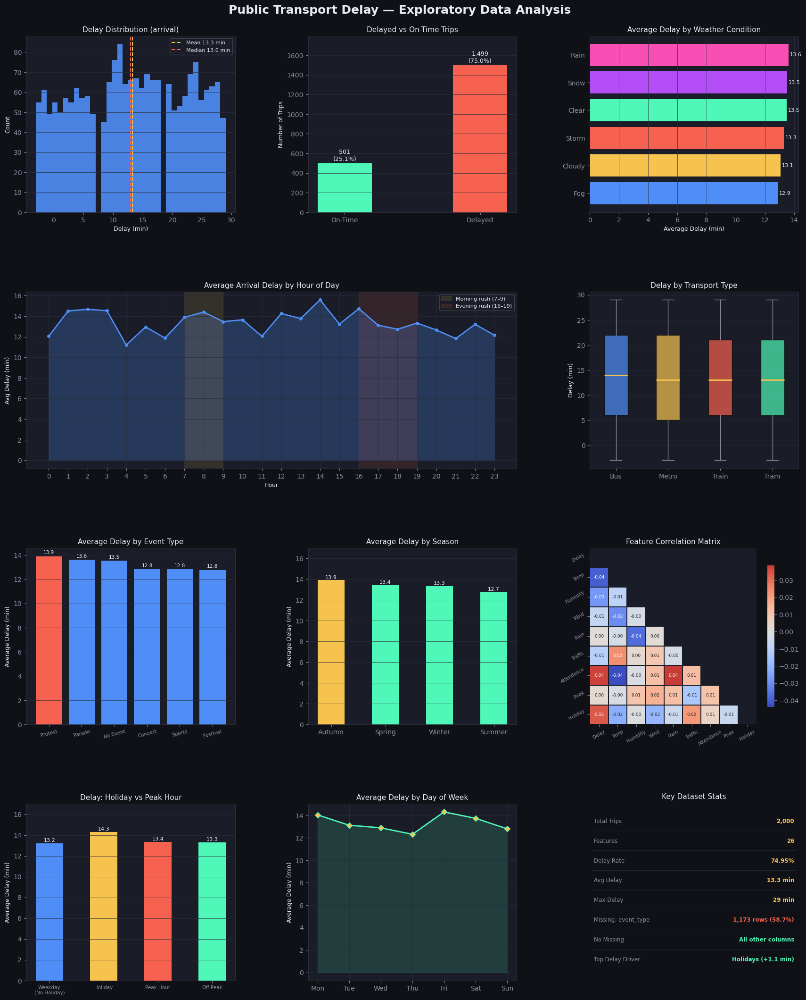
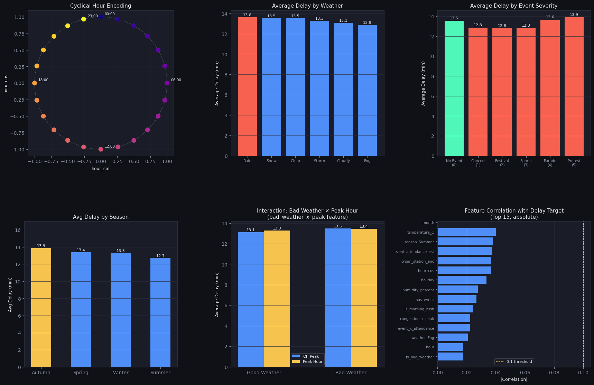
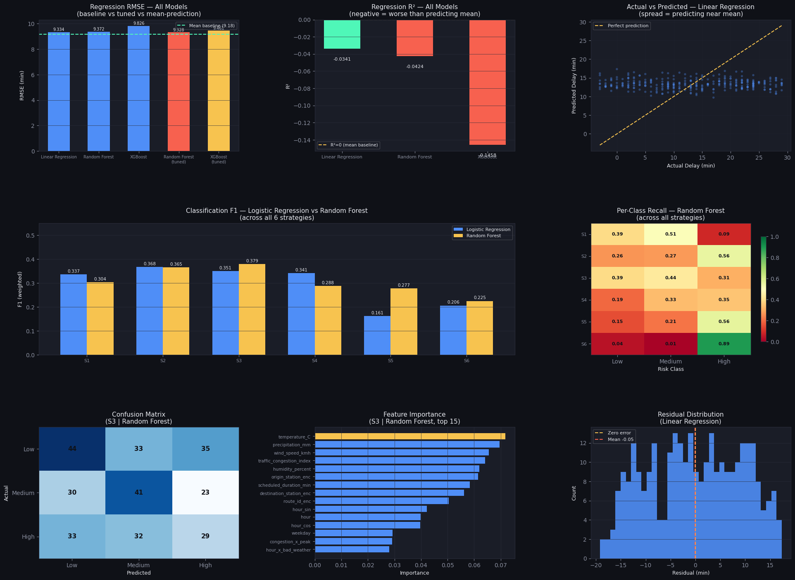
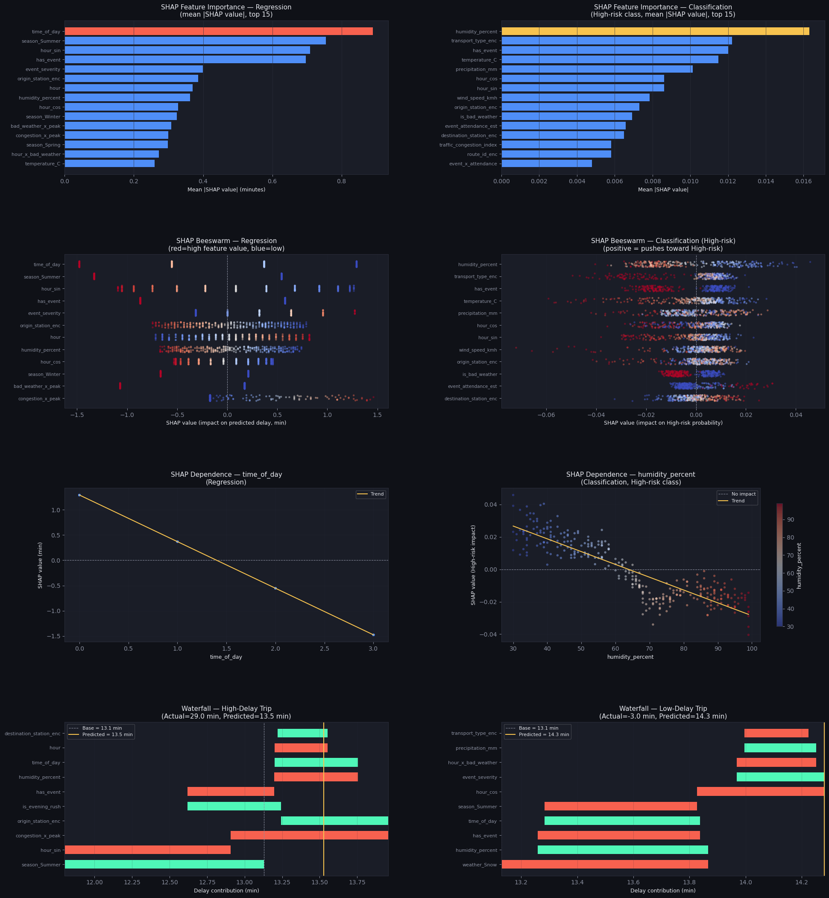
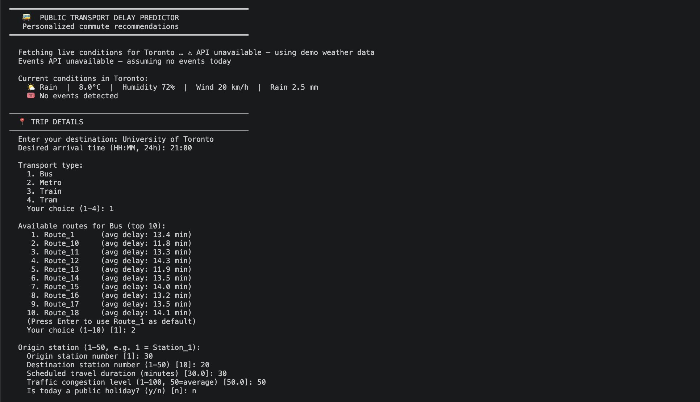
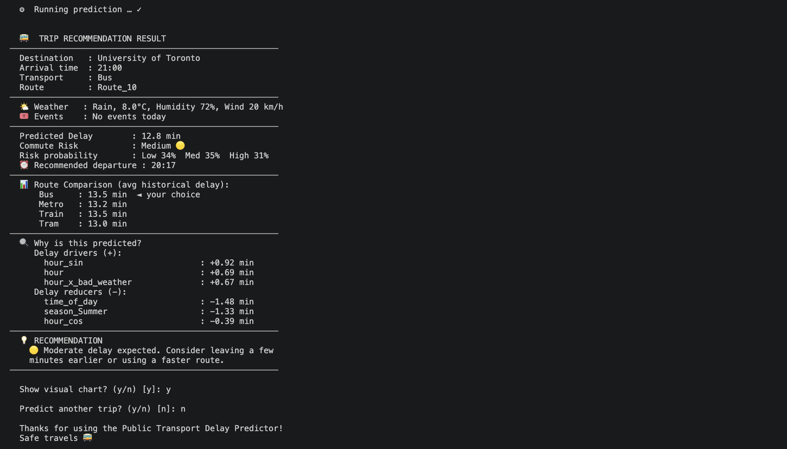

# Public Transport Delay Prediction & Commute Recommendation System

An end-to-end machine learning project that predicts public transport delays 
and provides personalized commute recommendations using live weather and event data.

**Potential applications include:**

- Smart commuting assistants
- Transit planning tools
- Traffic management systems
- Journey recommendation platforms

[Notebook](transport_delay_model.ipynb)

[Application](transport_delay_app.py)

---

## Key Results

- Built an end-to-end transit delay prediction pipeline using SQLite, machine learning, SHAP, and external APIs.
- Evaluated 3 regression models and 6 classification strategies.
- Integrated live weather (OpenWeatherMap) and event (Ticketmaster) APIs into a recommendation engine.
- Used SHAP explainability to identify the strongest drivers of transit delays and commute risk.
- Developed an interactive application that predicts delay, estimates commute risk, and recommends departure times.

---

## Project Architecture

```
Kaggle Dataset
      ↓
SQL Database (SQLite)
      ↓
Exploratory Data Analysis
      ↓
Feature Engineering
      ↓
Regression + Classification Models
      ↓
SHAP Explainability
      ↓
Interactive CLI Application
      ↓
Live Weather & Event APIs
```

---

## Project Overview

| Phase | Description |
|-------|-------------|
| 1 | Data collection & SQL database setup |
| 2 | Data quality check |
| 3 | Exploratory Data Analysis (EDA) |
| 4 | Feature Engineering |
| 5 | Machine Learning Modeling |
| 6 | Model Explainability (SHAP) |
| 7 | Interactive CLI app with live weather & events APIs |

---

## Tech Stack

- Python
- Pandas
- NumPy
- Scikit-Learn
- XGBoost
- SHAP
- Matplotlib / Seaborn
- SQLite
- imbalanced-learn (SMOTE)
- OpenWeatherMap API
- Ticketmaster API

---

## File Structure

```
├── transport_delay_model.ipynb     ← Main notebook: Phase 1–6 (EDA → SHAP)
├── transport_delay_app.ipynb       ← Phase 7: App code walkthrough
├── transport_delay_app.py          ← Interactive CLI app (run from Terminal)
├── .env.example                    ← API key template (copy to .env)
├── .gitignore
└── README.md
```

> **Note:** `public_transport_delays.csv` and `transport_features.csv` are excluded
> from this repo via `.gitignore`. Download the dataset from Kaggle (see Setup below)
> and run the notebook to generate `transport_features.csv`.

---

## Screenshots

<details>
<summary>EDA Dashboard</summary>

<br>



<br><br>

</details>

<details>
<summary>Feature Visualization</summary>



<br><br>

</details>

<details>
<summary>Model Summary</summary>



<br><br>

</details>

<details>
<summary>SHAP Explainability</summary>



<br><br>

</details>

<details>
<summary>Interactive CLI App</summary>




</details>

---

## Setup

### 1. Clone the repo
```bash
git clone https://github.com/tracychanty/smart-commute-prediction-recommendation-system.git
cd smart-commute-recommendation-system
```

### 2. Install dependencies
```bash
pip install pandas numpy matplotlib seaborn scikit-learn xgboost lightgbm \
            shap imbalanced-learn python-dotenv requests
```

### 3. Download the dataset
Download the **Public Transport Delays with Weather and Events** dataset from
[Kaggle](https://www.kaggle.com/) and place `public_transport_delays.csv`
in the project root.

### 4. Set up API keys (optional — app runs with demo data without them)
```bash
cp .env.example .env
```
Edit `.env` and add your free API keys:
- **OpenWeatherMap**: [openweathermap.org/api](https://openweathermap.org/api)
- **Ticketmaster**: [developer.ticketmaster.com](https://developer.ticketmaster.com)

### 5. Run the main notebook
Open `transport_delay_model.ipynb` in Jupyter or VS Code and run all cells.
This covers Phase 1–6 and generates `transport_features.csv`.

### 6. Launch the interactive app
```bash
python transport_delay_app.py
```

---

## Hypotheses

| | Hypothesis | Outcome |
|--|------------|---------|
| H1 | Weather conditions (rain, snow, storm) are the strongest predictors of transit delay | ❌ Rejected — SHAP analysis showed time and seasonal features were stronger predictors |
| H2 | Time-based factors (peak hour, time of day, day of week) compound delay when combined with adverse weather or nearby events | ⚠️ Partially supported — interaction features present but with small contributions |
| H3 | Public events (protests, parades, concerts) increase delay beyond the baseline, with larger and more disruptive events having greater impact. | ⚠️ Partially supported — events appear in SHAP top features but absolute contributions remain below 0.7 min |
| H4 | ML model trained on weather, time, and event features can predict delay magnitude and classify commute risk | ⚠️ Partially rejected — classification F1=0.379, regression R²<0 |

---

## Models

### Regression — Predict delay (minutes)
| Model | RMSE | R² |
|-------|------|----|
| Linear Regression | 9.33 min | -0.034 |
| Random Forest | 9.37 min | -0.042 |
| XGBoost | 9.83 min | -0.146 |
| Mean-prediction baseline | 9.18 min | 0.000 |

Despite testing Linear Regression, Random Forest, and XGBoost, all models achieved negative R² scores. This indicates that the available features contain limited predictive signal for exact delay magnitude.

This finding itself is valuable, as it demonstrates a complete machine learning workflow, rigorous model evaluation, hypothesis testing, and transparent reporting rather than presenting artificially inflated results. The results suggest that richer operational data such as GPS tracking, passenger volume, service disruptions, and real-time traffic information would be required for accurate delay forecasting.

### Classification — Predict commute risk (Low / Medium / High)
| Strategy | F1 | Accuracy |
|----------|----|----------|
| **S3: Fixed bins + SMOTE + Random Forest** | **0.379** | **0.380** |
| S2: Quantile bins + Logistic Regression | 0.374 | 0.367 |
| S1: Baseline (no correction) | 0.337 | 0.337 |

Six strategies were tested across two model families (Logistic Regression and
Random Forest), varying binning approach, SMOTE oversampling, and class weighting.

---

## Key SHAP Findings

- **Regression:** `time_of_day`, `season_Summer`, and `hour_sin` are the top
  features — time and seasonal structure drive predictions more than weather
- **Classification:** `humidity_percent`, `transport_type_enc`, and `has_event`
  dominate High-risk predictions
- All SHAP contributions are below ±1.5 min, confirming no single feature
  pushes predictions far from the base value — consistent with weak correlations

---

## Decision Support Application

Run `python transport_delay_app.py` from Terminal. The app asks:

1. Destination
2. Desired arrival time
3. Transport type (Bus / Metro / Train / Tram)
4. Route (filtered to your chosen transport type)
5. Origin & destination station
6. Scheduled travel duration
7. Traffic congestion level
8. Is today a holiday?

Then fetches **live weather** (OpenWeatherMap) and **live events** (Ticketmaster),
runs the trained models, and outputs:

```
  🚌  TRIP RECOMMENDATION RESULT
───────────────────────────────────────────────────────
  Destination   : University of Toronto
  Arrival time  : 09:00  |  Transport: Metro
───────────────────────────────────────────────────────
  Predicted Delay        : 13.5 min
  Commute Risk           : Medium 🟡
  ⏰ Recommended departure : 08:24
───────────────────────────────────────────────────────
  💡 RECOMMENDATION
    🟡  Moderate delay expected. Consider leaving a
    few minutes earlier or using a faster route.
───────────────────────────────────────────────────────
```

---

## Limitations

- Dataset uses synthetic station names and route IDs — destination input is
  used for display only and does not affect model predictions
- A temporal train/test split (first 70% of dates → train) would be more
  rigorous for production use than the random split used here
- With ~2,000 rows and weak feature signal, model performance is modest. 
  Real-world improvement would require richer data (GPS tracking, passenger
  load, incident logs)

---

## License
MIT
